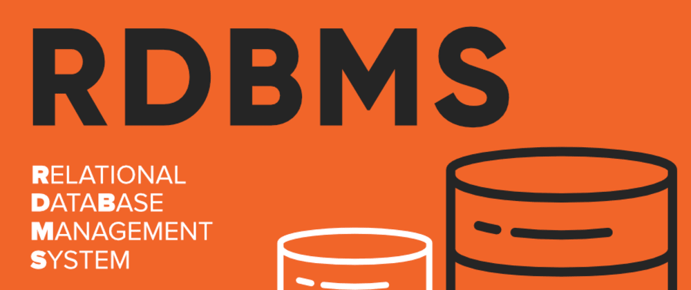

# 关系型数据库

---

- [MySQL](/repository/Databases/RDBMS/MySQL/README.md#MySQL)
- [PostgreSQL](/repository/Databases/RDBMS/PostgreSQL/README.md#PostgreSQL)
- [SQLite](/repository/Databases/RDBMS/SQLite/README.md#SQLite)