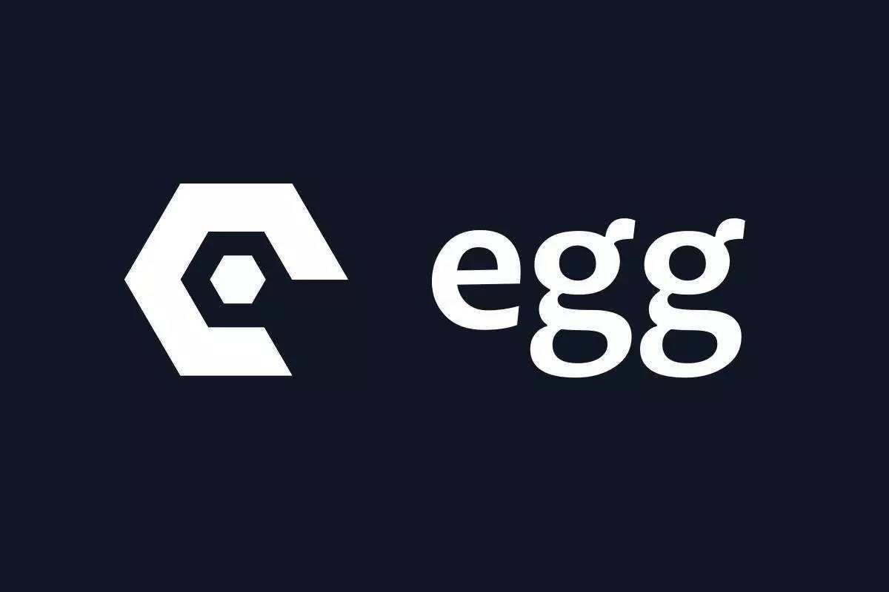

# 框架

---

  - [Application生命周期函数](/repository/Frameworks/Egg/docs/Application生命周期函数.md#application生命周期函数)
  - [EggJS插件](/repository/Frameworks/Egg/docs/Plugins/README.md#eggjs-插件)
    - [egg-sequelize](/repository/Frameworks/Egg/docs/Plugins/egg-sequelize.md#egg-sequelize)
    - [egg-mongoose](/repository/Frameworks/Egg/docs/Plugins/egg-mongoose.md#egg-mongoose)
    - [egg-graphql](/repository/Frameworks/Egg/docs/Plugins/egg-graphql.md#egg-graphql)
    - [egg-socket.io](/repository/Frameworks/Egg/docs/Plugins/egg-socket.io.md#egg-socketio)

