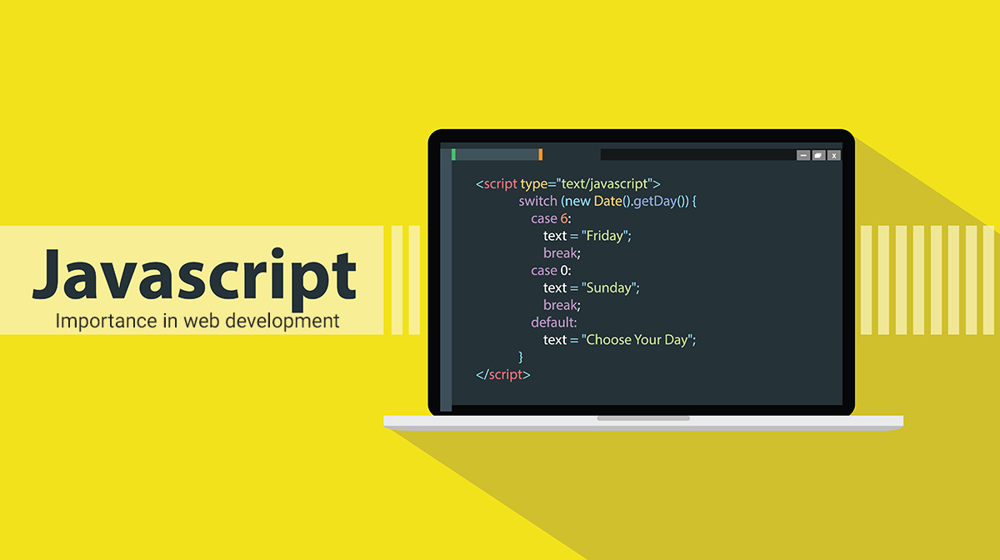

# JavaScript

---

- [ChildProcess模块](/repository/Languages/JavaScript/docs/ChildProcess.md#childprocess模块)
  - [ChildProcess事件](/repository/Languages/JavaScript/docs/ChildProcessEvents.md#childprocess事件)
    - [close](/repository/Languages/JavaScript/docs/ChildProcessEvents.md#close)
    - [disconnect](/repository/Languages/JavaScript/docs/ChildProcessEvents.md#disconnect)
    - [error](/repository/Languages/JavaScript/docs/ChildProcessEvents.md#error)
    - [exit](/repository/Languages/JavaScript/docs/ChildProcessEvents.md#exit)
    - [message](/repository/Languages/JavaScript/docs/ChildProcessEvents.md#message)
    - [spawn](/repository/Languages/JavaScript/docs/ChildProcessEvents.md#spawn)
    - [stdio.data](/repository/Languages/JavaScript/docs/ChildProcessEvents.md#stdiodata)
    - [stdio.close](/repository/Languages/JavaScript/docs/ChildProcessEvents.md#stdioclose)
    - [stdio.end](/repository/Languages/JavaScript/docs/ChildProcessEvents.md#stdioend)
    - [stdio.error](/repository/Languages/JavaScript/docs/ChildProcessEvents.md#stdioerror)
  - [ChildProcess对象API](/repository/Languages/JavaScript/docs/ChildProcessAPI.md#childprocess对象api)
    - [属性](/repository/Languages/JavaScript/docs/ChildProcessAPI.md#属性)
      - [channel](/repository/Languages/JavaScript/docs/ChildProcessAPI.md#channel)
      - [connected](/repository/Languages/JavaScript/docs/ChildProcessAPI.md#connected)
      - [exitCode](/repository/Languages/JavaScript/docs/ChildProcessAPI.md#exitCode)
      - [killed](/repository/Languages/JavaScript/docs/ChildProcessAPI.md#killed)
      - [pid](/repository/Languages/JavaScript/docs/ChildProcessAPI.md#pid)
      - [signalCode](/repository/Languages/JavaScript/docs/ChildProcessAPI.md#signalCode)
      - [spawnargs](/repository/Languages/JavaScript/docs/ChildProcessAPI.md#spawnargs)
      - [spawnfile](/repository/Languages/JavaScript/docs/ChildProcessAPI.md#spawnfile)
      - [stderr](/repository/Languages/JavaScript/docs/ChildProcessAPI.md#stderr)
      - [stdin](/repository/Languages/JavaScript/docs/ChildProcessAPI.md#stdin)
      - [stdout](/repository/Languages/JavaScript/docs/ChildProcessAPI.md#stdout)
      - [stdio](/repository/Languages/JavaScript/docs/ChildProcessAPI.md#stdio)
    - [方法](/repository/Languages/JavaScript/docs/ChildProcessAPI.md#方法)
      - [channel.ref()](/repository/Languages/JavaScript/docs/ChildProcessAPI.md#channelref)
      - [channel.unref()](/repository/Languages/JavaScript/docs/ChildProcessAPI.md#channelunref)
      - [kill()](/repository/Languages/JavaScript/docs/ChildProcessAPI.md#killsignal)
      - [disconnect()](/repository/Languages/JavaScript/docs/ChildProcessAPI.md#disconnect)
      - [ref()](/repository/Languages/JavaScript/docs/ChildProcessAPI.md#ref)
      - [send()](/repository/Languages/JavaScript/docs/ChildProcessAPI.md#sendmessage-sendhandle-options-callback)
      - [unref()](/repository/Languages/JavaScript/docs/ChildProcessAPI.md#unref)