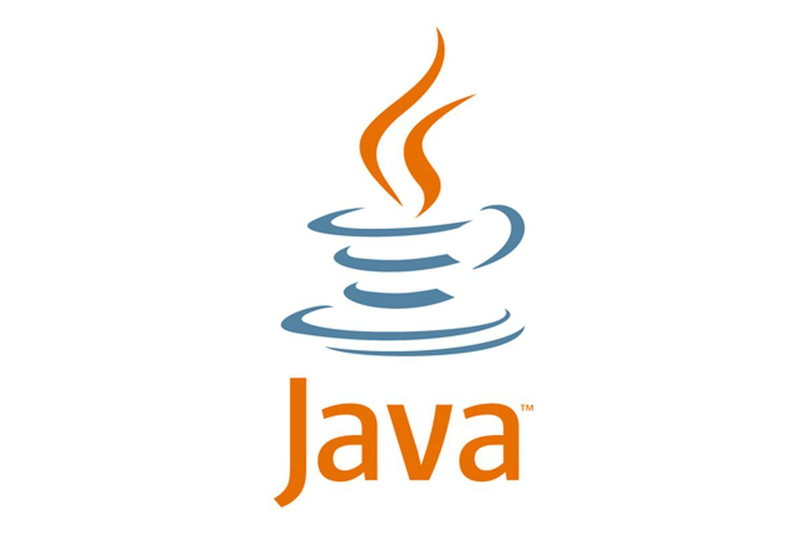

# 编程语言

---

---

---

- [ChildProcess模块](/repository/Languages/JavaScript/docs/ChildProcess.md#childprocess模块)
  - [ChildProcess事件](/repository/Languages/JavaScript/docs/ChildProcessEvents.md#childprocess事件)
  - [ChildProcess对象API](/repository/Languages/JavaScript/docs/ChildProcessAPI.md#childprocess对象api)
    - [属性](/repository/Languages/JavaScript/docs/ChildProcessAPI.md#属性)
      - [channel](/repository/Languages/JavaScript/docs/ChildProcessAPI.md#channel)
      - [connected](/repository/Languages/JavaScript/docs/ChildProcessAPI.md#connected)
      - [exitCode](/repository/Languages/JavaScript/docs/ChildProcessAPI.md#exitCode)
      - [killed](/repository/Languages/JavaScript/docs/ChildProcessAPI.md#killed)
      - [pid](/repository/Languages/JavaScript/docs/ChildProcessAPI.md#pid)
      - [signalCode](/repository/Languages/JavaScript/docs/ChildProcessAPI.md#signalCode)
      - [spawnargs](/repository/Languages/JavaScript/docs/ChildProcessAPI.md#spawnargs)
      - [spawnfile](/repository/Languages/JavaScript/docs/ChildProcessAPI.md#spawnfile)
      - [stderr](/repository/Languages/JavaScript/docs/ChildProcessAPI.md#stderr)
      - [stdin](/repository/Languages/JavaScript/docs/ChildProcessAPI.md#stdin)
      - [stdout](/repository/Languages/JavaScript/docs/ChildProcessAPI.md#stdout)
      - [stdio](/repository/Languages/JavaScript/docs/ChildProcessAPI.md#stdio)
    - [方法](/repository/Languages/JavaScript/docs/ChildProcessAPI.md#方法)
      - [channel.ref()](/repository/Languages/JavaScript/docs/ChildProcessAPI.md#channelref)
      - [channel.unref()](/repository/Languages/JavaScript/docs/ChildProcessAPI.md#channelunref)
      - [kill()](/repository/Languages/JavaScript/docs/ChildProcessAPI.md#killsignal)
      - [disconnect()](/repository/Languages/JavaScript/docs/ChildProcessAPI.md#disconnect)
      - [ref()](/repository/Languages/JavaScript/docs/ChildProcessAPI.md#ref)
      - [send()](/repository/Languages/JavaScript/docs/ChildProcessAPI.md#sendmessage-sendhandle-options-callback)
      - [unref()](/repository/Languages/JavaScript/docs/ChildProcessAPI.md#unref)

---

---

  - [logging模块配置示例](/repository/Languages/Python/docs/logging模块配置示例.md#logging模块配置示例)

---

