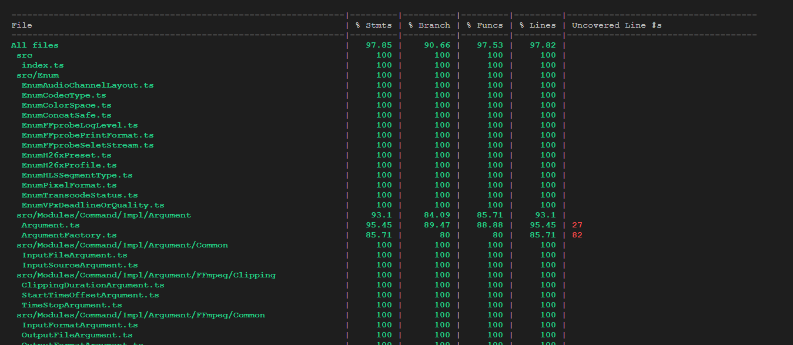
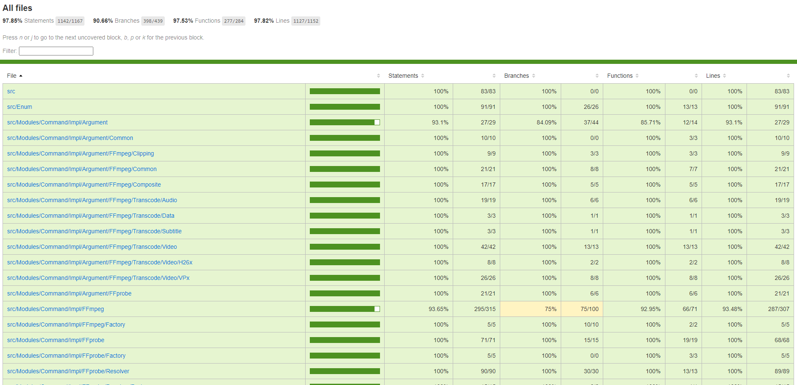

# Mocha生成单元测试覆盖率报告

---

?> 单元测试代码的覆盖率越高固然越好, 但不必一味追求测试的高覆盖率, 覆盖率高不等于bug少, 问题少. 单一模块的单元测试覆盖率再高, 并不会保证该模块在与其他模块进行交互和相互调用后就一定不出问题, 也不能保证在高负载高并发下, 功能依旧正常. 覆盖率仅仅只是一个指标数值而已, 并不能完全衡量代码的质量.

## 安装nyc

```bash
npm i nyc -D
```

## 修改测试脚本

修改package.json文件中设置的测试命令, 在其前面添加

> nyc --reporter=html --reporter=text

其中参数
- --reporter=text

  测试结束后, 在控制台输出代码覆盖率的文字报告

  

- --reporter=html

  测试结束后, 在当前项目目录下生成coverage目录, 其中包含HTML格式代码覆盖率报告

  

## 测试报告说明

覆盖率报告中主要包含以下几个维度的统计结果

- Stmts

  有效代码语句覆盖率, 即测试经过的有效代码在总有效代码中的占比, 有效代码语句是不包含{,}等语句块分割符的

- Branch

  分支覆盖率, 即测试经过的分支在总分支数的占比, 代码中的if-else, 三元运算符, switch-case, 函数参数默认值, 均会产生分支

- Funcs

  函数覆盖率, 即测试执行过的function在总function数的占比

- Lines

  代码行覆盖率, 即测试经过的代码行数在总代码行数的占比
