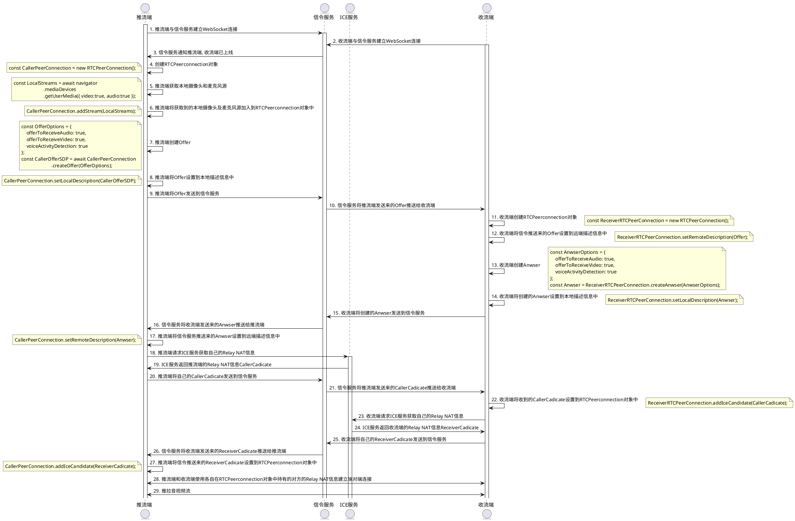

# WebRTC源码分析

---

本源码分析的WebRTC源码版本为: 4147(m84)

[Chromium分支与版本号](https://chromiumdash.appspot.com/branches)

---

## 一次完整的WebRTC推拉流交互流程

?> 源码分析基于上述一次完整流程中类出现JavaScript类的顺序进行, 会对该JS类对应的到WebRTC源码中的C++类进行逐一分析

|JavaScript类|涉及到的C++类|
|:-|:-|
|RTCPeerConnection|[PeerConnectionInterface](/repository/Libraries/WebRTC/docs/源码分析/PeerConnectionInterface.md#peerconnectioninterface-源码分析)|
|MediaStream|[MediaStreamInterface](/repository/Libraries/WebRTC/docs/源码分析/MediaStreamInterface.md#MediaStreamInterface-源码分析)|
|RTCSessionDescription|[SessionDescriptionInterface](/repository/Libraries/WebRTC/docs/源码分析/SessionDescriptionInterface.md#SessionDescriptionInterface-源码分析) [SetSessionDescriptionObserver](/repository/Libraries/WebRTC/docs/源码分析/SetSessionDescriptionObserver.md#SetSessionDescriptionObserver-源码分析)|
|RTCIceCandidate|[IceCandidateInterface](/repository/Libraries/WebRTC/docs/源码分析/IceCandidateInterface.md#IceCandidateInterface-源码分析)|

