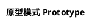

# 原型模式 Prototype

---

## UML


```plantuml
@startuml 原型模式 Prototype
title 原型模式 Prototype

@enduml
```

## 介绍


## 使用场景


## 优缺点

### 优点

- 

### 缺点

- 

## 注意事项

- 

## 实现方式

- 

## 示例

```java

```

## 扩展

- 