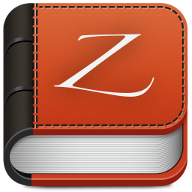

# Dash/Zeal

---

Dash与Zeal均是离线文档查看工具, 后者是受前者影响而开发的, 其中Dash在PC端仅提供MacOS平台的客户端, Zeal则提供了Windows平台的客户端.

Zeal可以访问Dash的默认文档仓库, 两者在文档库的格式上是完全兼容的.

## 安装

访问Dash/Zeal的官方站点下载客户端
- [Dash](https://kapeli.com/dash)
- [Zeal](https://zealdocs.org/download.html)

## 使用

以下操作均以Zeal为例, Dash的操作基本雷同

### 下载&添加docset

打开Zeal, 点击菜单栏 Tools -> Docsets

打开Docsets管理界面

其中会罗列当前已经安装和配置的文档库

点击"avaliable"选项卡, 可以查看当前所有可用的文档库, 库列表抓取自Dash的官方网仓库, 如果列表为空, 可以点击下方的"Refresh"按钮重新抓取文档库列表.

在列表中找到并选中需要的文档库, 点击右下方的"Download"按钮即可开始下载. 下载完成后即可在Zeal主界面左侧的列表中看到该文档库.

### 将第三方制作的文档库加入Zeal

上述文档库列表来自Dash官方提供, Zeal和Dash还支持添加第三方兼容格式的文档库

下面以"sequelize"文档库为例, 介绍如何将第三方制作的文档库加入Zeal

1. 下载第三方docset

  访问[第三方文档库](https://zealusercontributions.vercel.app/), 在搜索框输入"sequelize"检索

  

  点击"Download"下的任意下载链接即可下载

  下载完成后得到文件 *Sequelize.tgz*

2. 将第三方docset加入Zeal

  打开Zeal, 点击菜单栏 Edit -> Preferences

  打开Zeal的设置窗口

  

  点击最下方 "Docket storage" 中的 "Browser..." 按钮, 即可打开Zeal的docst存储目录

  将上一步骤下载得到的文件 *Sequelize.tgz* 解压到该目录下

  得到 "Sequelize.docset" 文件夹

  关闭Zeal, 再次打开, 可以看到 sequelize 的文档已经展示在Zeal左侧的文档列表中了

  