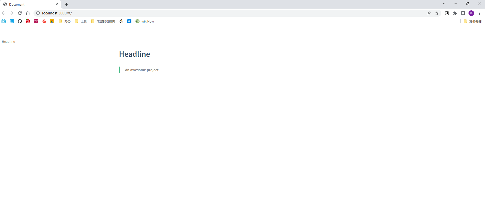

# Docsify安装与配置

---

## Docsify命令行工具的安装

安装的先觉环境条件
- NodeJS
- NPM

安装docsify命令行工具
```bash
npm install -g docsify-cli
```

## 初始化Docsify文档库

本地新建一个文件夹作为Docsify文档库

新建完成后在新建的目录中打开CMD或其他终端工具

执行命令初始化Docsify

```bash
docsify init [options]
```

options为可选参数, 按需添加
- --local, -l

  是否本地化Docsify, 如果选择本地化, 则会将所有Docsify文件拷贝到当前目录, 否则只拷贝必要的文件, 所有页面需要的JS将会在访问时通过CND地址加载, 默认值: false

- --theme, -t

  选择初始化的Docsify主题, 可选值为:
  - vue
  - buble
  - dark
  - pure

  默认值: vue

- --plugins, -p

  初始化时是否选择启用内置插件, 默认值: false, 添加此参数可以在初始化时选择启用内置插件

### 目录结构

以全默认参数初始化当前目录即可, 初始化完成后当前目录的文件结构如下

```bash
.
├── README.md
└── index.html
```

其中*README.md*为Docsify的首页内容markdown文件, *index.html* 为Docsify的入口页面

## 启动Docsify服务

使用以下命令启动本地Docsify服务

```bash
docsify serve
```

默认服务监听本地3000端口


监听启动后打开浏览器访问即可看到Docsify的首页



?> 至此Docsify的文档库初始化就完成了, 通过编写markdown文件, 即可实现将其自动选为页面了.

## Docsify配置

Docsify基本是开箱即用的, 完成上面的步骤就可以直接使用了, 配置大多是一些个性化而非功能性的

[Docsify配置项](https://docsify.js.org/#/zh-cn/configuration)