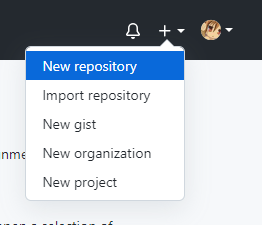
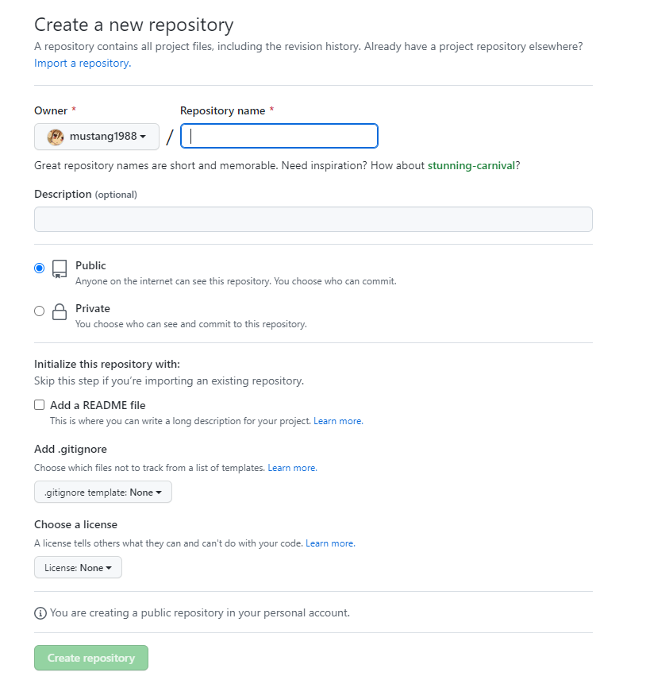
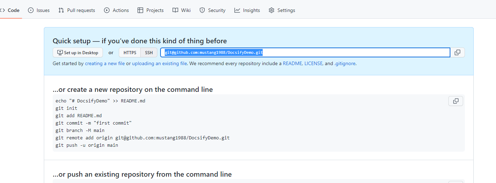
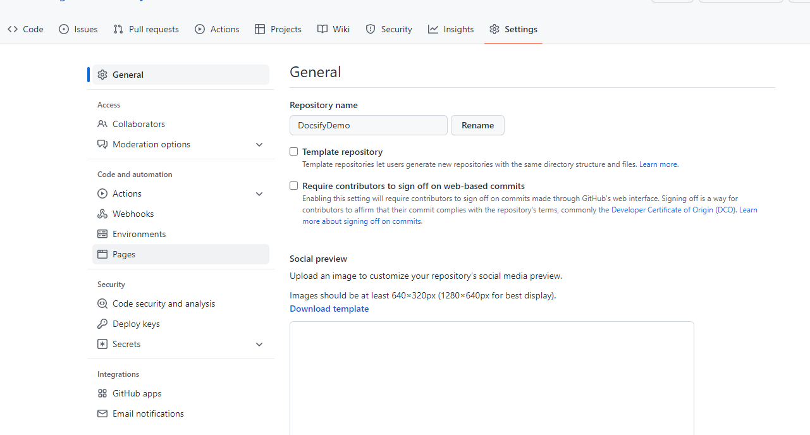

# 通过GitHubPage部署Docsify编写的文档库

---

## 创建GitHub库

1. 打开浏览器访问 [GitHub](https://github.com/) 并登录自己的账号

2. 点击右上角用户头像左侧的"+"按钮, 在弹出的菜单中点击 "New repository"

  

3. 填写仓库名称和描述信息, 建议**不**勾选 "Add a README file" 前的Checkbox, 后面初始化的时候会自动创建README.md文件

  

4. 点击底部的"Create repository" 按钮完成仓库创建

## Git拉取库到本地

仓库创建完成后, 会自动跳转到仓库首页, 复制仓库的git地址, 拉取仓库到本地



```bash
git clone <仓库地址>
```

clone完成后, 使用终端进入该目录, 创建文档编辑用分支 *develop*, 默认分支 main 用作文档库发布用, 所有的文档编写和改动都会提交到 develop 分支, 当文档编写完成发布时再合并到 main 分支即可.

```bash
git checkout -b develop
```

## 初始化Docsify文档库

Docsify文档库初始化参考: [Docsify安装与配置](/repository/Tools/Docsify/docs/Docsify安装与配置.md)

## 提交并推送文档改动

文档编写完成后, 将改动提交到 develop 分支

```bash
git add .
git commit -m "改动说明"
git push origin develop
```

## 配置GitHubPage

访问GitHub上的仓库页面, 点击顶部的 "Settings" 选项卡



点击页面左侧列表中的 "Pages", 打开GitHubPage配置

在Source栏中选择发布用的分支 "main", 路径就选择index.html所在的目录, 并点击 "Save" 按钮, 完成配置

文档库会默认发布到以下地址:

```
https://<github用户名>.github.io/<文档仓库名>/
```

## 发布文档

本地使用git将develop分支的改动合并到发布用的 *main* 分支, 然后push该分支到GitHub

## 访问GitHubPage上的文档库

发布分支推送后大约30秒即可通过GitHub分配的发布地址访问了

## 配置自己独立的域名

在GitHubPage的配置页面, "Source" 下方的 "Custom domain" 中可以填入自己购买并完成ICP备案的域名, 填写后, 即可通过自己的域名替换掉默认的"<用户名>.github.io"的域名访问发布的文档库了