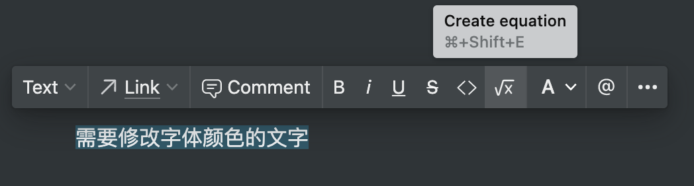

# Notion中如何使用任意字体颜色

---

## Notion字体颜色

Notion中内置了10种字体颜色, 满足基本的内容标记使用, 但在某些需求情况下可能会不够用或无法满足一些个性化需求.

## 如何在文字上使用自定义字体颜色

使用Notion提供的Equation即可实现任意字体颜色

例如

当前我需要将一段已经编写好的文字标记为 <span style="color: #A6DEAB;">浅绿色</span> , 颜色值如下

- 16进制: <span style="color: #A6DEAB;">#A6DEAB</span>
- RGB: <span style="color: #A6DEAB;">(166,222,171)</span>

1. 选中需要设置自定义颜色的内容

  

2. 点击悬浮窗中的 *Create equation* 进入公式编辑模式

  

3. 通过公式编辑, 为字体添加颜色

  设置字体颜色的公式格式如下:

  ```latex
  \color{字体颜色16进制值}{文字内容}
  ```

  

4. 点击公式编辑模式结尾的 *<span style="color: #1b9dcb;">Done</span>* 按钮完成设置

## 如何在文字上使用自定义字体背景颜色

与自定义字体颜色的使用方法类似, 只是使用的公式不同, 字体背景颜色设置的公式如下:

```latex
\colorbox{背景颜色16进制值}{文字内容}
```

示例:


## 背景颜色与字体颜色的混合设置

字体的背景颜色和字体颜色是可以同时设置的, 方法就是将上述背景颜色公式中的, *文字内容* 部分替换为字体颜色设置公式的内容即可

```latex
\colorbox{背景颜色16进制值}{\color{字体颜色16进制值}{文字内容}}
```

示例:

