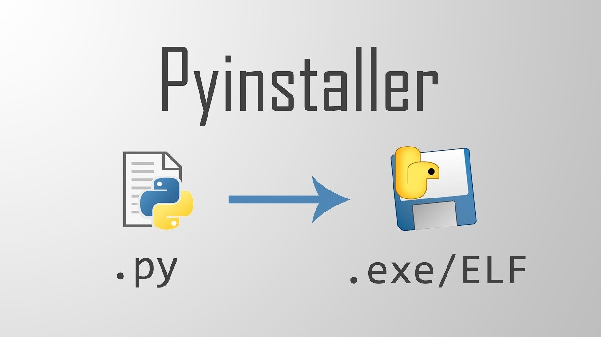
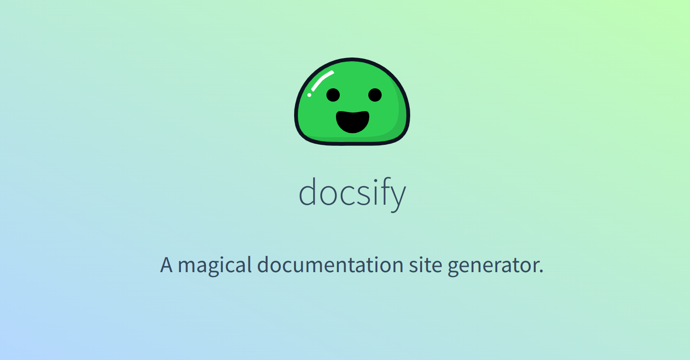

# 工具

---

  - [Docker的安装与使用入门](/repository/Tools/Docker/docs/Docker的安装与使用入门.md#Docker的安装与使用入门)

---

  - [Windows下编译带NVENC编解码支持的FFmpeg](/repository/Tools/FFmpeg/docs/Windows下编译带NVENC编解码支持的FFmpeg.md#windows下编译支持nvenc编码器的ffmpeg)
  - [FFmpeg命令常用参数](/repository/Tools/FFmpeg/docs/FFmpeg命令常用参数.md#FFmpeg命令常用参数)
    - [通用参数](/repository/Tools/FFmpeg/docs/Common/README.md#通用参数)
      - [-i](/repository/Tools/FFmpeg/docs/Common/-i.md#i)
      - [-f](/repository/Tools/FFmpeg/docs/Common/-f.md#f)
      - [-threads](/repository/Tools/FFmpeg/docs/Common/-threads.md#threads)
      - [-sn](/repository/Tools/FFmpeg/docs/Common/-sn.md#sn)
      - [-dn](/repository/Tools/FFmpeg/docs/Common/-dn.md#dn)
      - [-an](/repository/Tools/FFmpeg/docs/Common/-an.md#an)
      - [-vn](/repository/Tools/FFmpeg/docs/Common/-vn.md#vn)
      - [-y](/repository/Tools/FFmpeg/docs/Common/-y.md#y)
    - [视频流操作参数](/repository/Tools/FFmpeg/docs/VideoStream/README.md#视频流操作参数)
      - [通用视频流操作参数](/repository/Tools/FFmpeg/docs/VideoStream/Common/README.md#通用视频流操作参数)
        - [-g](/repository/Tools/FFmpeg/docs/VideoStream/Common/-g.md#g)
        - [-intra](/repository/Tools/FFmpeg/docs/VideoStream/Common/-intra.md#intra)
        - [-r](/repository/Tools/FFmpeg/docs/VideoStream/Common/-r.md#r)
        - [-c:v](/repository/Tools/FFmpeg/docs/VideoStream/Common/-c_v.md#cv)
        - [-b:v](/repository/Tools/FFmpeg/docs/VideoStream/Common/-b_v.md#bv)
        - [-pix_fmt](/repository/Tools/FFmpeg/docs/VideoStream/Common/-pix_fmt.md#pix_fmt)
      - [H.264, H.265(HEVC)视频流操作参数](/repository/Tools/FFmpeg/docs/VideoStream/H.26x/README.md#h264-h265hevc视频流操作参数)
        - [-preset](/repository/Tools/FFmpeg/docs/VideoStream/H.26x/-preset.md#preset)
        - [-profile:v](/repository/Tools/FFmpeg/docs/VideoStream/H.26x/-profile_v.md#profilev)
      - [VP8, VP9视频流操作参数](/repository/Tools/FFmpeg/docs/VideoStream/VPx/README.md#vp8-vp9视频流操作参数)
        - [-speed](/repository/Tools/FFmpeg/docs/VideoStream/VPx/-speed.md#speed)
        - [-row-mt](/repository/Tools/FFmpeg/docs/VideoStream/VPx/-row-mt.md#row-mt)
        - [-frame-parallel](/repository/Tools/FFmpeg/docs/VideoStream/VPx/-frame-parallel.md#frame-parallel)
        - [-tile-columns](/repository/Tools/FFmpeg/docs/VideoStream/VPx/-tile-columns.md#tile-columns)
        - [-quality](/repository/Tools/FFmpeg/docs/VideoStream/VPx/-quality.md#quality)
        - [-deadline](/repository/Tools/FFmpeg/docs/VideoStream/VPx/-deadline.md#deadline)
        - [-cpu-used](/repository/Tools/FFmpeg/docs/VideoStream/VPx/-cpu-used.md#cpu-used)
        - [-level](/repository/Tools/FFmpeg/docs/VideoStream/VPx/-level.md#level)
    - [音频流操作参数](/repository/Tools/FFmpeg/docs/AudioStream/README.md#音频流操作参数)
      - [-c:a](/repository/Tools/FFmpeg/docs/AudioStream/-c_a.md#c_a)
      - [-b:a](/repository/Tools/FFmpeg/docs/AudioStream/-b_a.md#b_a)
      - [-ar](/repository/Tools/FFmpeg/docs/AudioStream/-ar.md#ar)
    - [视频合成操作参数](/repository/Tools/FFmpeg/docs/Composite/README.md#视频合成操作参数)
      - [-safe](/repository/Tools/FFmpeg/docs/Composite/-safe.md#safe)
    - [视频分片操作参数](/repository/Tools/FFmpeg/docs/Segment/README.md#视频分片操作参数)
      - [-hls_time](/repository/Tools/FFmpeg/docs/Segment/-hls_time.md#hls_time)
      - [-hls_list_size](/repository/Tools/FFmpeg/docs/Segment/-hls_list_size.md#hls_list_size)
      - [-hls_segment_type](/repository/Tools/FFmpeg/docs/Segment/-hls_segment_type.md#hls_segment_type)
      - [-hls_segment_filename](/repository/Tools/FFmpeg/docs/Segment/-hls_segment_filename.md#hls_segment_filename)
    - [视频剪辑操作参数](/repository/Tools/FFmpeg/docs/Clipping/README.md#视频剪辑操作参数)
      - [-ss](/repository/Tools/FFmpeg/docs/Clipping/-ss.md#ss)
      - [-to](/repository/Tools/FFmpeg/docs/Clipping/-to.md#to)
      - [-t](/repository/Tools/FFmpeg/docs/Clipping/-t.md#t)
  
  ---
  
  - [FFmpeg常用处理命令](/repository/Tools/FFmpeg/docs/FFmpeg常用处理命令.md#ffmpeg常用处理命令)
    - [将视频转码为支持Web页面Video标签播放的格式](/repository/Tools/FFmpeg/docs/Commands/将视频转码为支持Web页面Video标签播放的格式.md#将视频转码为支持web页面video标签播放的格式)
    - [H.264视频转码后画面失真问题研究](/repository/Tools/FFmpeg/docs/H.264视频转码后画面失真问题研究.md#h264视频转码后画面失真问题研究)
    - [为无音频流的视频文件添加空白音频流](/repository/Tools/FFmpeg/docs/Commands/为无音频流的视频文件添加空白音频流.md#为无音频流的视频文件添加空白音频流)
    - [视频文件生成预览图序列](/repository/Tools/FFmpeg/docs/Commands/视频文件生成预览图序列.md#视频文件生成预览图序列)
    - [获取视频指定帧的画面图片](/repository/Tools/FFmpeg/docs/Commands/获取视频指定帧的画面图片.md#获取视频指定帧的画面图片)
    - [FFmpeg创建纯色视频文件](/repository/Tools/FFmpeg/docs/FFmpeg创建纯色视频文件.md#ffmpeg创建纯色视频文件)
    - [FFmpeg屏幕录制](/repository/Tools/FFmpeg/docs/FFmpeg屏幕录制.md#ffmpeg屏幕录制)
  
  ---
  
  - [FFprobe命令常用参数](/repository/Tools/FFmpeg/docs/FFprobe命令常用参数.md#FFprobe命令常用参数)
    - [-i](/repository/Tools/FFmpeg/docs/FFprobe/-i.md#i)
    - [-v](/repository/Tools/FFmpeg/docs/FFprobe/-v.md#v)
    - [-show_streams](/repository/Tools/FFmpeg/docs/FFprobe/-show_streams.md#show_streams)
    - [-show_format](/repository/Tools/FFmpeg/docs/FFprobe/-show_format.md#show_format)
    - [-show_frame](/repository/Tools/FFmpeg/docs/FFprobe/-show_frame.md#show_frame)
    - [-show_packets](/repository/Tools/FFmpeg/docs/FFprobe/-show_packets.md#show_packets)
    - [-select_streams](/repository/Tools/FFmpeg/docs/FFprobe/-select_streams.md#select_streams)
    - [-show_entries](/repository/Tools/FFmpeg/docs/FFprobe/-show_entries.md#show_entries)
    - [-of](/repository/Tools/FFmpeg/docs/FFprobe/-of.md#of)
  
  ---
  
  - [FFprobe常用处理命令](/repository/Tools/FFmpeg/docs/FFprobe常用处理命令.md#ffprobe常用处理命令)
    - [获取媒体文件元信息](/repository/Tools/FFmpeg/docs/Commands/获取媒体文件元信息.md#获取媒体文件元信息)

---

  - [Git工作流](/repository/Tools/Git/docs/Gitflow.md#GitWorkflow)
  - [约定式提交](/repository/Tools/Git/docs/ConventionalCommits.md#约定式提交)

---

  - [Notion中如何使用任意字体颜色](/repository/Tools/Notion/Notion中如何使用任意字体颜色.md#notion中如何使用任意字体颜色)

--

  - [如何在NPM上发布自己的包](/repository/Tools/NPM/如何在NPM上发布自己的包.md#如何在NPM上发布自己的包)
  - [NPX](/repository/Tools/NPM/docs/NPX.md#NPX)

---

  - [在VSCode中单步调试TypeScript和JavaScript](/repository/Tools/VSCode/在VSCode中单步调试TypeScript和JavaScript.md#在vscode中单步调试typescript)
  - [VSCode插件](/repository/Tools/VSCode/docs/Plugins/README.md#vscode-插件)
    - [Project Manager](/repository/Tools/VSCode/docs/Plugins/ProjectManager.md#projectmanager)
    - [CodeSnap](/repository/Tools/VSCode/docs/Plugins/CodeSnap.md#codesnap)

---

  - [Pyinstaller打包Python项目](/repository/Tools/Pyinstaller/Pyinstaller打包Python项目.md#pyinstaller打包python项目)

---

  - [Docsify安装与配置](/repository/Tools/Docsify/docs/Docsify安装与配置.md#Docsify安装与配置)
  - [通过GitHubPage部署Docsify编写的文档库](/repository/Tools/Docsify/docs/通过GitHubPage部署Docsify编写的文档库.md#通过GitHubPage部署Docsify编写的文档库)

---

- [Dash/Zeal](/repository/Tools/Dash_Zeal/README.md#dashzeal)