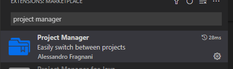
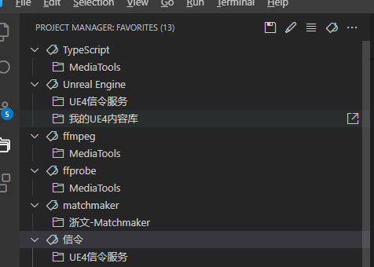
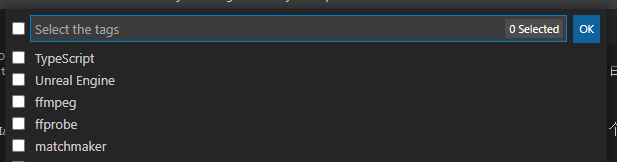

# ProjectManager

---

## ProjectManager介绍

ProjectManager 是一个用于管理本地代码项目的插件, 但本地有多个项目并行开发或维护时, 在VSCode中, 要么将多个项目的文件统一添加到一个工作区中, 打开的时候一并打开, 项目较少时还好, 当项目数量较多时, 就有些力不从心了, 经常在列表中找很久才找得到, 要么就去磁盘上找到项目目录再新开一个VSCode窗口, 总之就是很麻烦.

ProjectManager插件就可以解决上面遇到的痛点, 它可以把本地磁盘上的项目进行标签化分类, 排序, 一键在新VSCode窗口中打开.

## 插件安装

1. 打开VSCode的插件市场, 检索 "project manager"

  

2. 点击右侧插件说明页顶部的 "安装" 按钮

## 插件配置

插件安装完成后, 左侧活动栏中会新增一个 "ProjectManager" 的工具栏, 点击后会在左侧打开项目管理面板


项目管理面板顶部有4个功能按钮, 分别为


- 保存当前打开的目录为项目
- 编辑当前项目信息
- 视图切换
- 标签过滤器

## 插件使用

- 保存当前打开的目录为项目

  用VSCode打开一个项目目录, 点击 ProjectManager 顶部的 "保存项目" 按钮, 在弹出的输入框中输入一个项目名称, 按下Enter键即可保存当前打开的目录为项目, 该项目会罗列在ProjectManager插件的项目列表中

- 为项目添加标签

  在ProjectManager的项目列中, 右击项目名称, 在弹出的菜单中选择 "Edit Tag" 或 点击项目列表顶部的 "Edit Project" 按钮, 打开ProjectManager的项目配置文件

  ProjectManager的项目配置文件为一个JSON格式内容的文件, 内容为一个对象数组, 数组的每个元素对应一个项目, 每个项目中包含以下几个属性可供编辑:

  | 属性名   | 属性说明                                                       | 属性值数据类型 |
  | :------- | :------------------------------------------------------------- | :------------- |
  | name     | 项目名称                                                       | String         |
  | rootPath | 项目目录在磁盘中的路径                                         | String         |
  | tags     | 项目标签                                                       | String[]       |
  | enabled  | 项目是否启用, 未启用的项目不会出现在ProjectManager的项目列表中 | Boolean        |

  配置文件示例: 

  ```json
  [
	{
		"name": "我的UE4内容库",
		"rootPath": "d:\\Code\\PGU\\unreal-repo",
		"paths": [],
		"tags": [
			"Unreal Engine"
		],
		"enabled": true
	},
	{
		"name": "MediaTools",
		"rootPath": "d:\\Code\\PGU\\MediaTools",
		"paths": [],
		"tags": [
			"ffmpeg",
			"ffprobe",
			"TypeScript"
		],
		"enabled": true
	},
	{
		"name": "UE4信令服务",
		"rootPath": "d:\\Code\\PGU\\signallingwebserver",
		"paths": [],
		"tags": [
			"信令",
			"Unreal Engine"
		],
		"enabled": true
	}
    //...
  ]
  ```

- 在新窗口打开项目

  在ProjectManager插件的项目列表中, 当鼠标指向任意项目名称后, 其后会有一个 "Open in New Window" 的按钮, 点击此按钮, 该项目就会在新的VSCode窗口中打开

- 按标签分类查看项目

  点击ProjectManager插件的项目列表顶部的 "View as Tags" 按钮, 项目列表中的项目, 就会在项目名称列表和标签分类列表两个试图之间进行切换

  

- 按标签过滤项目

  点击ProjectManager插件的项目列表顶部的 "Filter Projects by Tag" 按钮, 在弹出的列表中, 勾选需要的项目标签, 则所有不符合过滤条件的项目, 就会项目列表中隐藏, 仅显示符合过滤条件的项目

  