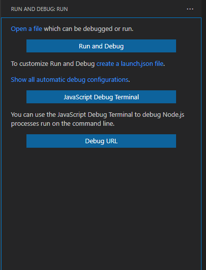
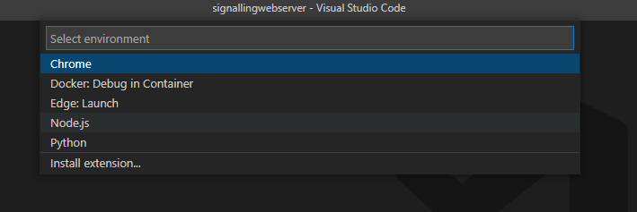
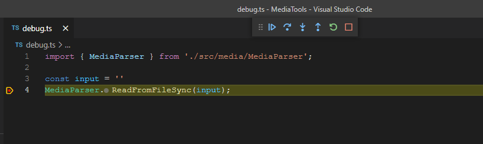
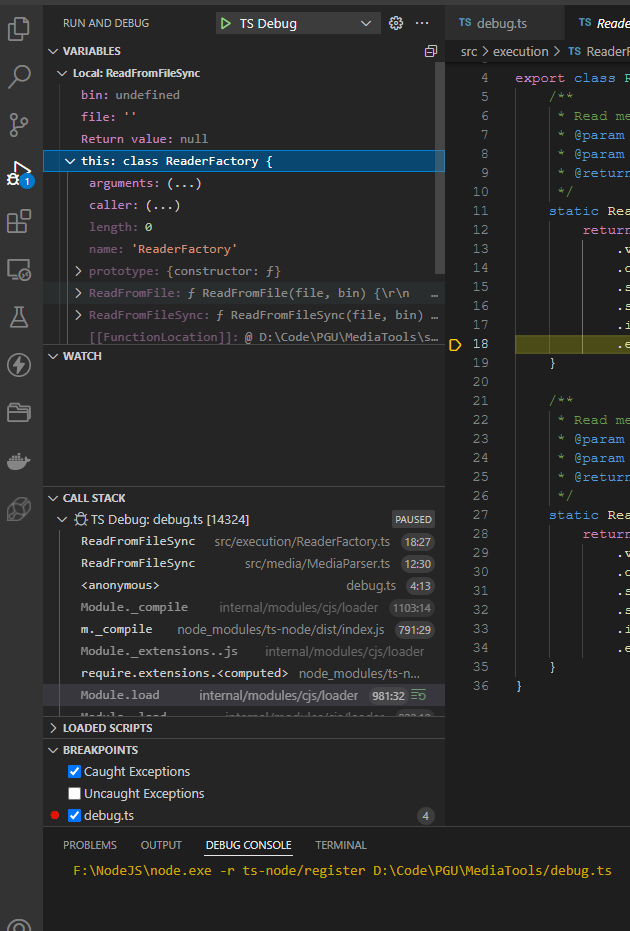

# 在VSCode中单步调试TypeScript和JavaScript

---

## 创建调试用入口文件

在项目中新建一个调试用的调用入口文件, 编写代码调用需要进行单步调试的代码

## 创建调试配置文件

在VSCode中点击左侧工具栏中的"Run and Debug"

在打开的面板中点击"Run and Debug"按钮下方的"create a launch.json file"



在弹出的选择窗中选择"Node.js"



此时会在项目目录下".vscode"目录中创建名为"launch.json"的配置文件

launch.json配置文件默认内容:

```javascript
{
  // Use IntelliSense to learn about possible attributes.
  // Hover to view descriptions of existing attributes.
  // For more information, visit: https://go.microsoft.com/fwlink/?linkid=830387
  "version": "0.2.0",
  "configurations": [
    {
      "type": "pwa-node",
      "request": "launch",
      "name": "Launch Program",
      "skipFiles": [
        "<node_internals>/**"
      ],
      "program": "${workspaceFolder}\\cirrus.js"
    }
  ]
}
```

修改此配置文件, 修改后内容如下:

```javascript
{
  "version": "0.2.0",
  "configurations": [
    {
      "type": "node",
      "request": "launch",
      "name": "TS Debug",
      "runtimeArgs": ["-r", "ts-node/register"],
      "args": ["${workspaceFolder}/debug.ts"]
    }
  ]
}
```

其中

- *runtimeArgs*为TypeScript运行时所需要, 依赖于npm包*ts-node*, 需要先自行安装

?> 如果是调试JavaScript代码, 这runtimeArgs配置是不需要的

- *args*为前面创建的调试用入口文件, 变量"${workspaceFolder}"为VSCode中项目的根目录路径

## 运行单步调试

在需要调试的类, 函数等前点击添加断点, 再通过左侧工具栏打开调试运行界面, 点击顶部的调试按钮, 启动调试

当运行到断点所在函数时, 会进入调试模式, 顶部会有单步调试按钮



单步调试按钮
- 顺序执行(F9)
- 单步执行(F8)
- 进入函数内(F7)
- 跳出函数堆栈(Shift+F8)
- 重启调试
- 终止调试

调试过程中左侧面板会显示当前调用的堆栈列表和变量当前值

