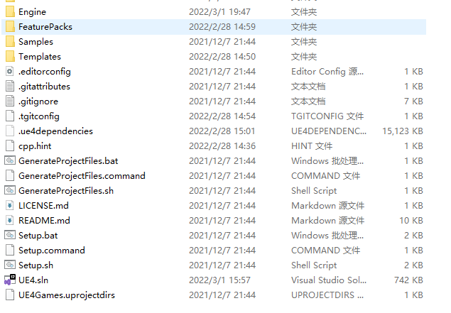
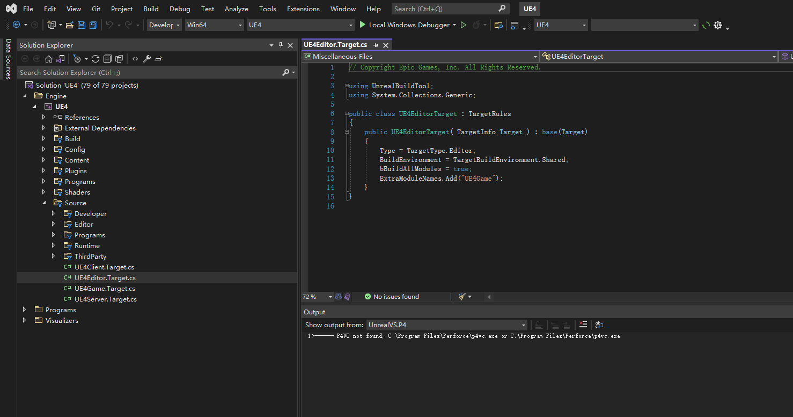

# Unreal Engine 源码使用

---

## 源码获取

[Unreal Engine 官方仓库](https://github.com/EpicGames/UnrealEngine)

!> 该仓库并非Public的, 需要先加入 EpicGames 的组织后才可以访问该仓库

获取源码的方式, 任选其一即可
- 使用 Git Clone 仓库源码到本地

  需要较好的网络环境, 耗时较长

- 下载Release列表中对应版本的ZIP包

  速度较快, 推荐

## 环境准备

具体环境准备可参考 [UE 官方说明文档](https://docs.unrealengine.com/4.27/en-US/Basics/InstallingUnrealEngine/RecommendedSpecifications/) 的要求
- DirectX Runtime, [下载地址](https://www.microsoft.com/en-us/download/details.aspx?id=8109)
- Visual Studio 2017 或 2019, [下载地址](https://visualstudio.microsoft.com/zh-hans/vs/community/), 推荐使用2019或更高版本, 社区版即可, 企业版/专业版不是必须的
  - Visual Studio 建议安装以下组件
    - .NET 桌面开发
    - 通用Windows平台开发
    - 使用C++的游戏开发
    - .NET Framework 4.6 SDK & 目标包
    - Windows 10 SDK

### 先决条件安装器

源码目录下 *Engine/Extras/Redist/en-us* 目录内有编译好的先决条件安装器, 执行该安装器可以安装必须的环境

该先决条件安装器是使用UE源码编译获得的, 其源码位于 *Engine\Source\Programs\PrereqInstaller* 目录中, 有能力的用户可以自行修改

## 依赖处理

执行源码目录中的 *Setup.bat* 脚本文件, 其会自动检查和处理所需的依赖组件, 下载一些UE第三方库的预编译结果, 此步骤会比较耗时需要耐心等待

?> 期间会下载10~15GB左右的文件

## 生成VS解决方案

执行源码目录中的 *GenerateProjectFiles.bat* 脚本文件, 会在目录下生成 VS 解决方案文件 *UE4.sln*

## 编译&调试

使用 Visual Studio 打开 *UE4.sln*, 将运行模式调整为开发模式, 即可开始编译与调试, 初次编译大约需要消耗40~60分钟的时间, 具体时长视开发机配置而定

?> 使用 CPU: I7 11700, RAM: 32GB, HDD 的配置, 初次编译耗时约4小时, 可作为参考, 配置低于该配置的机器编译耗时会更长

!> 支持Debug的版本最终编译产物+源码会占用至少80GB的磁盘空间, 极端情况下会占用超过140GB的磁盘空间, 需要注意编译用磁盘分区的剩余可用空间

