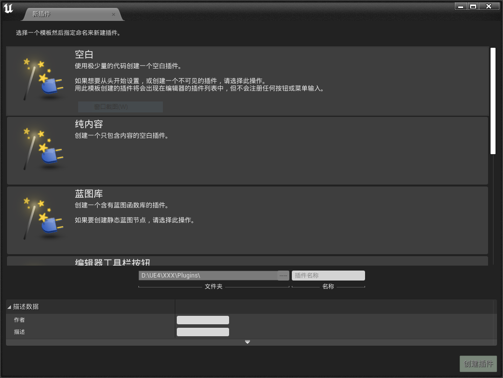
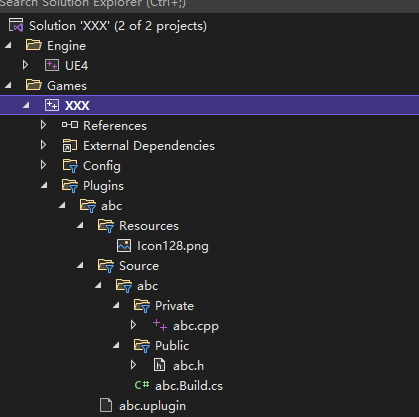

# 自定义插件的开发示例

---

## UE内置的插件模板

UE为插件提供了以下几种模板

|||
|:-|:-|
|空白|完全空白只包含最基本的插件加载相关代码的插件模板|
|纯内容|用于只存放诸如材质,材质函数等UE资产的插件模板|
|蓝图库|用于存放蓝图函数等与蓝图有关的资产的插件模板|
|编辑器工具栏按钮|用于为编辑器顶部工具栏添加工具按钮实现快捷功能的插件模板|
|编辑器独立窗口|**TODO**|
|编辑器模式|**TODO**|
|第三方库|用于为UE提供第三方库的加载调用相关的插件模板|

## 创建自定义插件

### 新建项目

建议新建项目时使用C++新建, 非蓝图项目, 因为C++项目中可以不适用C++仅使用蓝图开发, 而在蓝图项目中默认是没有C++直接支持的, 当然在蓝图项目中通过编辑器新建一个C++类后, 这个项目也就跟着变成了C++项目, 而不再是纯蓝图项目了.

### 创建自定义插件

载入新建的项目后, 点击菜单栏 编辑->插件, 打开插件管理面板



点击面板右下角的"新插件"按钮即可新建一个自定义插件, UE内置了多种插件的模板, 不同的模板仅影响初始化后插件代码文件的布局与初始代码逻辑, 根据具体需要自行选择即可, 本文使用的是空白模板创建插件

在插件模板选择窗口中可以填入一些基本信息, 其中*插件名称*为必填, 其他字段可选择性填入
- *插件名称*
- 作者
- 描述
- 作者URL
- 是否为Beta版本

填写完成后点击"创建插件"按钮, 即可完成插件的创建, 插件初始化后会存储在以下路径中

> 项目目录/plugins/填入的插件名称

### 插件目录介绍

UE的插件目录层级与项目层级很类似, 大致目录结构如下



```bash
# 本示例中插件名称为 abc
.
├── Binaries
│   └── Win64
│     ├── UE4Editor-abc.dll
│     ├── UE4Editor-abc.pdb
│     └── UE4Editor.modules
├── Content
├── Intermediate
│   └── Build
│     ├── BuildRules
│     │   ├── abcModuleRules.dll
│     │   ├── abcModuleRules.pdb
│     │   └── abcModuleRulesManifest.json
│     └── Win64
│       └── UE4Editor
├── Resources
│   └── Icon128.png
├── Source
│   └── abc
│     ├── Private
│     │   └── abc.cpp
│     ├── Public
│     │   └── abc.h
│     └── abc.Build.cs
└── abc.uplugin
```

目录结构说明

|文件/目录名称|说明|
|:-|:-|
|Binaries|存储插件代码编译后生成的可执行文件与dll|
|Content|存储插件中提供的UE资产文件, 例如材质, 材质函数, 蓝图等|
|Intermediate|中间临时目录, 用于存储编译生成的文件, 运行时日志等|
|Resources|静态资源目录, 默认内容为一张图片, 是插件在UE插件列表中的图标|
|Source|插件源代码目录|
|Source/插件名称/Private|插件内部逻辑实现和不允许外部访问的代码目录|
|Source/插件名称/Public|插件中用于外部公开访问的代码目录, 一般只用于存放允许其他插件访问的头文件|
|Source/插件名称.Build.cs|插件编译构建用C#脚本文件|
|Source/插件名称.uplugin|JSON格式的插件配置文件, 创建插件时填写的作者等信息, 均存储在该文件内|

## 自定义插件相关

### 使用插件为UE添加自定义资产类型

- [为UE添加自定义资产类型](/repository/UnrealEngine/为UE添加自定义资产类型.md#为UE添加自定义资产类型)